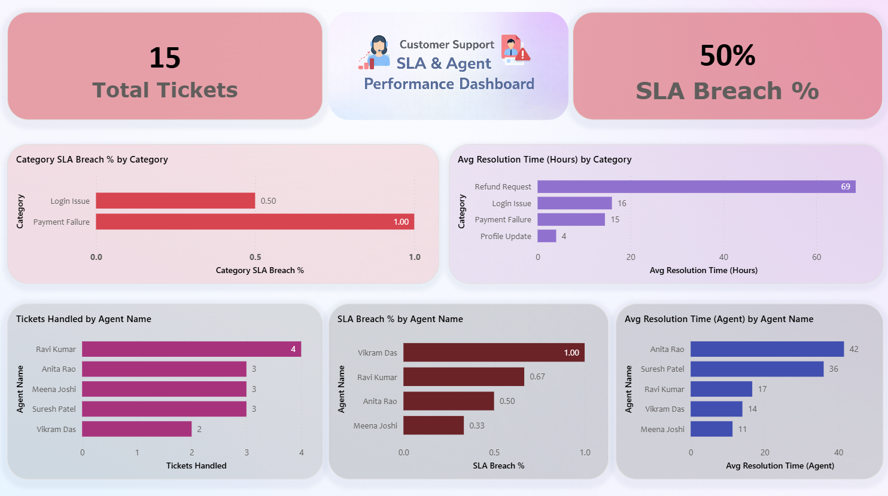

📊 Dashboard Preview




# 📊 Customer Support SLA & Agent Performance Dashboard

An end-to-end **Business Intelligence project** built using **SQL, Power BI, and DAX** to analyze customer support ticket data, monitor SLA compliance, and evaluate agent performance.

---

## 📑 Table of Contents

- [How To Use](#how-to-use)
- [Project Overview](#project-overview)
- [Business Objectives](#business-objectives)
- [Key KPIs](#key-kpis)
- [Dataset](#dataset)
- [SQL Data Preparation](#sql-data-preparation)
- [Power BI Dashboard](#power-bi-dashboard)
- [Repository Structure](#repository-structure)
- [Major DAX Used](#major-dax-used)
- [Tools & Technologies Used](#tools--technologies-used)
- [Outcome & Learnings](#outcome--learnings)
- [Author](#author)

...

## 🧪 How to Use

1. Download the CSV from /Data
2. Open the `.pbix` in Power BI Desktop
3. Refresh data and interact with visuals

---

## 📊 Project Overview

This project analyzes customer support ticket data to:
- Track **SLA breach trends**
- Evaluate **agent efficiency**
- Identify **bottlenecks in ticket resolution**
- Support **data-driven operational decisions**

The dashboard provides actionable insights for support managers to improve service quality and response times.

---

## 🎯 Business Objectives

- Monitor **overall SLA Breach Percentage**
- Analyze SLA breaches by **Category** and **Agent**
- Measure **Average Resolution Time**
- Identify **high and low performing agents**
- Detect categories causing **maximum delays**

---

## 📈 Key KPIs

- **Total Tickets**
- **SLA Breach %**
- **Average Resolution Time (Hours)**
- **Tickets Handled per Agent**
- **SLA Breach % by Agent & Category**

---

## 🗂 Dataset

- **Source:** Simulated customer support ticket data  
- **Granularity:** Ticket-level data  
- **Key Fields:**
  - Ticket ID  
  - Agent Name  
  - Category  
  - Resolution Time (Hours)  
  - SLA Breached (Yes/No)  
  - Status  

Datasets are available in the `/Data` folder.

---

## 🧮 SQL Data Preparation

SQL was used to:
- Derive **SLA breach flags**
- Aggregate ticket data by **Category** and **Agent**
- Calculate **Average Resolution Time**
- Prepare analytical datasets for Power BI

All SQL queries are available in the `/SQL` folder.

---

## 📊 Power BI Dashboard

The Power BI dashboard includes:

- **Category SLA Breach %**
- **Average Resolution Time by Category**
- **Tickets Handled by Agent**
- **SLA Breach % by Agent**
- **Average Resolution Time by Agent**

📷 Dashboard screenshots are available in the `/Screenshots` folder.

---

## 🗃 Repository Structure

```text
Customer-Support-SLA-Agent-Performance/
│
├── Data/
│   └── ticket_analysis.csv
│
├── SQL/
│   └── ticket_analysis.sql
│
├── Screenshots/
│   └── dashboard_preview.png
│
├── Support Ticket Analysis.pbix
└── README.md
```

---

## 📐 Major DAX Used

```DAX
Total Tickets = COUNT('Ticket Analysis'[Ticket_Id])

SLA Breach % =
DIVIDE(
    CALCULATE(
        COUNTROWS('Ticket Analysis'),
        'Ticket Analysis'[Sla_Breached] = "Yes"
    ),
    CALCULATE(
        COUNTROWS('Ticket Analysis'),
        'Ticket Analysis'[Sla_Breached] <> "Pending"
    )
)

Avg Resolution Time (Hours) =
AVERAGE('Ticket Analysis'[Resolution_Time_Hours])
```
---

## 🛠 Tools & Technologies Used
- SQL – Data preparation & aggregation
- Power BI – Data modeling & visualization
- DAX – KPI calculations
- GitHub – Version control & project hosting
  
---

## 🎓 Outcome & Learnings
- Built a production-style BI dashboard from raw data
- Applied real-world SLA monitoring logic
- Gained hands-on experience with SQL + Power BI modeling
- Improved business storytelling using KPIs and visuals
  
---

## 👤 Author

Rajat Bhaskar  
Aspiring Data Analyst  
📍 India  
🔗 GitHub: https://github.com/Rajat-Bhaskar
